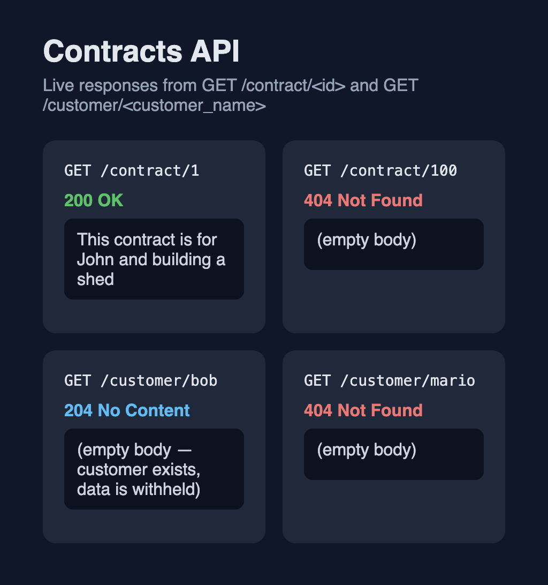

# Contracts API

A Flask app that looks up contract text and confirms whether a customer exists. Customer records are treated as sensitive, so a successful customer lookup returns **204 No Content** instead of any personal data.



## Routes

| Method and path | Found | Not found |
| --- | --- | --- |
| `GET /contract/<id>` | **200** and the contract's `contract_information` string | **404** with an empty body |
| `GET /customer/<customer_name>` | **204** with an empty body | **404** with an empty body |

Seed data lives in `server/app.py`:

- Contract IDs `1`, `2`, and `3`
- Customers `bob`, `bill`, `john`, and `sarah`

## Getting started

Requires [Pipenv](https://pipenv.pypa.io/).

```bash
git clone <your-fork-url>
cd python-flask-contracts-lab
pipenv install
pipenv shell
```

Start the development server from the project root:

```bash
python server/app.py
```

The app listens on [http://127.0.0.1:5555](http://127.0.0.1:5555).

## Usage

```bash
# Contract found — 200 and plain text
curl -i http://127.0.0.1:5555/contract/1

# Contract missing — 404
curl -i http://127.0.0.1:5555/contract/100

# Customer found — 204 and no body
curl -i http://127.0.0.1:5555/customer/bob

# Customer missing — 404
curl -i http://127.0.0.1:5555/customer/mario
```

## Tests

From the project root, with the virtualenv active:

```bash
pytest
```

Or without activating the shell:

```bash
pipenv run pytest
```

The suite checks that a known contract returns the expected text, a known customer returns an empty 204, and unknown ids or names return 404.

## License

This repository is Flatiron School educational content. See [LICENSE.md](LICENSE.md).
